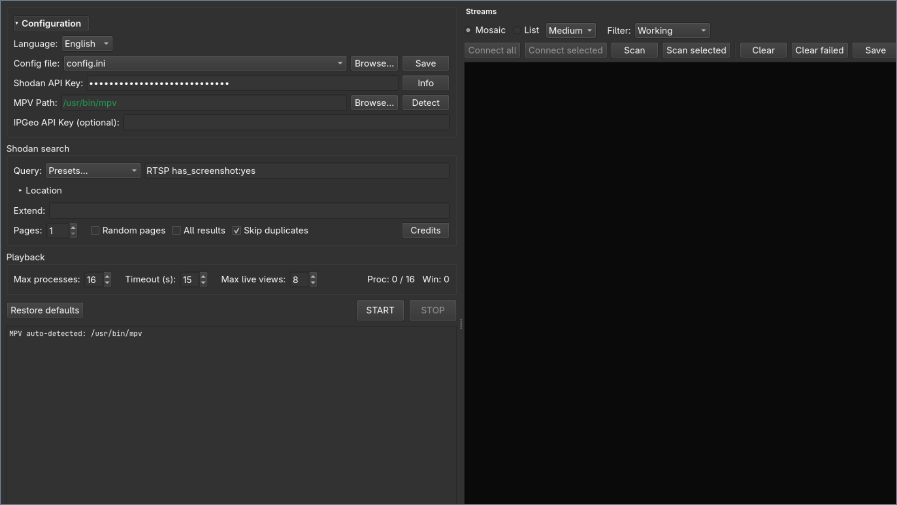
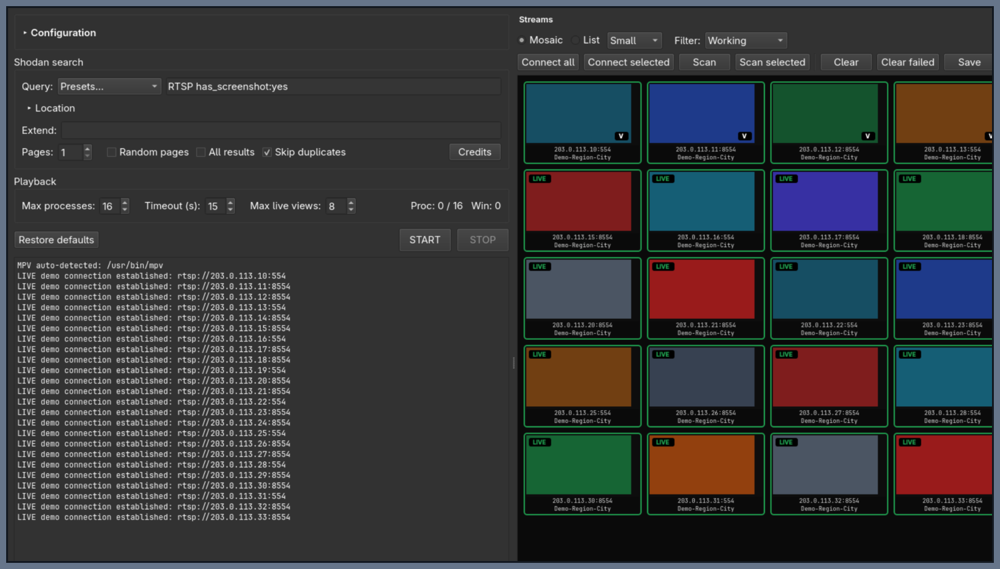

# VulnCam

VulnCam is a desktop RTSP stream manager powered by [Shodan](https://www.shodan.io) and [mpv](https://mpv.io). It searches for publicly indexed RTSP endpoints, verifies candidate streams, shows their thumbnails in a searchable mosaic, and lets you connect, record, or inspect streams from one interface.

> **Use responsibly.** Only query, connect to, or record systems that you own or have explicit permission to test. Shodan data can expose systems belonging to third parties.



## Highlights

- PyQt6 desktop GUI with English and Spanish translations.
- Shodan search presets, custom query extensions, page limits, random pages, and all-results mode.
- Parallel RTSP probing with a configurable process limit and connection timeout.
- List view and thumbnail mosaic view with small, medium, and large tiles.
- Stable 16:9 mosaic cells that keep their size when the viewport has spare space.
- Working, failed, audio/video, recording, authentication-required, and launching filters.
- RTSP audio-track detection and authentication probing.
- Double-click playback through mpv, embedded live previews in the mosaic, and background recording.
- Optional recording on connect, per-stream recording folders, and saved `.mkv` files.
- Save and load stream results as JSON, copy RTSP URLs or hosts, and inspect raw RTSP information.
- Cross-platform window detection for Linux/X11 and Windows.
- Command-line mode remains available for scripting and unattended scans.

## GUI

Start the desktop application with:

```bash
python gui.py
```

The left side contains configuration, Shodan search, filters, and playback limits. The right side contains the stream results. The initial view is the list; switch to **Mosaic** to compare thumbnails at a glance.



The screenshots use documentation-only demo data from `203.0.113.0/24`; the colored tiles, `LIVE` badges, and RTSP connection log are placeholders and do not represent live camera feeds.

### Typical workflow

1. Set the Shodan API key and mpv executable path in **Configuration**. The GUI attempts to detect mpv automatically.
2. Choose a preset or enter a Shodan query. Add country/city filters or query terms when needed.
3. Set **Pages**, **Max processes**, and **Timeout**. Increase the timeout on slower networks rather than lowering the parallelism blindly.
4. Press **START** to fetch candidates and probe them. Results appear in both the list and mosaic views.
5. Double-click a verified result or use its context menu to connect.
6. From the context menu, choose **View live**, **Record in background**, **Connect and start recording**, **Stream information**, or **Copy RTSP link**.
7. Use **Save** to export the current result list to JSON and **Load** to restore it later without repeating the Shodan query.

### Live view on Wayland

Embedded mpv previews use mpv's `--wid` option, which requires an X11 window ID. On Linux/Wayland sessions with XWayland available, VulnCam automatically starts Qt through `xcb` so live previews remain embedded in the mosaic. This is relevant to Hyprland/Omarchy, where `QT_QPA_PLATFORM` is often preset to `wayland;xcb`.

If XWayland is unavailable, VulnCam falls back to a normal mpv window instead of creating unmanaged windows over the desktop.

## Configuration

Copy the example configuration to your local, ignored `config.ini` and fill in your own values:

```bash
cp config.example.ini config.ini
```

Then edit `config.ini`:

```ini
[REQUIRED]
ShodanAPIKey = YOUR_SHODAN_API_KEY
MPVFilePath = /path/to/mpv

[OPTIONAL]
# IPGEOAPIKey = YOUR_IPGEO_API_KEY
```

On Windows, use the full path to `mpv.exe`, for example:

```ini
MPVFilePath = C:\\Program Files\\mpv\\mpv.exe
```

The optional IP geolocation key is used as a fallback when the public `ip-api.com` lookup does not return usable data.

`config.ini` is intentionally ignored by Git. Never commit real API keys or stream credentials; use `config.example.ini` as the shareable template.

## Installation

### Linux

Install Python 3.10 or newer, mpv, and the platform packages needed to inspect stream windows.

#### Arch Linux / Omarchy

```bash
sudo pacman -S --needed python python-pip mpv wmctrl
python -m venv .venv
source .venv/bin/activate
pip install -r requirements.txt
python gui.py
```

#### Debian / Ubuntu

```bash
sudo apt update
sudo apt install -y python3 python3-venv python3-pip mpv wmctrl
python3 -m venv .venv
source .venv/bin/activate
python -m pip install --upgrade pip
python -m pip install -r requirements.txt
python gui.py
```

On Debian/Ubuntu Wayland sessions, install and enable XWayland through the desktop environment packages if it is not already present. Embedded live previews need XWayland because mpv's `--wid` integration requires an X11 window ID; normal mpv playback and the CLI do not require embedding.

### Windows

Install Python, mpv, and the Python dependencies:

```powershell
py -m venv .venv
.venv\Scripts\activate
pip install -r requirements.txt
py gui.py
```

Set `MPVFilePath` to `mpv.exe` if automatic detection does not find it.

## Command line

The original command-line workflow is still supported:

```bash
python vulncam.py --help
```

Examples:

```bash
# Search the default query and open verified streams through mpv
python vulncam.py

# Add a Shodan term and fetch three pages
python vulncam.py --extend 'country:ES' --pages 3

# Retrieve all available results, record streams, and keep successful windows open
python vulncam.py --total-results --stream-record --leave-windows

# Increase concurrency and enable diagnostic logging
python vulncam.py --max-processes 16 --max-windows 8 --verbose
```

| Option | Description |
| --- | --- |
| `-c`, `--config` | Configuration file; defaults to `config.ini`. |
| `-q`, `--query` | Base Shodan query; defaults to `RTSP has_screenshot:yes`. |
| `-x`, `--extend` | Extra Shodan terms appended to the base query. |
| `-p`, `--pages` | Number of result pages to fetch. |
| `-r`, `--random-pages` | Choose pages randomly. |
| `-t`, `--total-results` | Retrieve all results through the Shodan cursor. |
| `-s`, `--stream-record` | Record streams to MKV files. |
| `-m`, `--max-processes` | Maximum number of parallel mpv processes; default is 16. |
| `-w`, `--max-windows` | Maximum number of visible stream windows. |
| `-l`, `--leave-windows` | Leave working windows open when the scan ends. |
| `-v`, `--verbose` | Enable diagnostic logging. |

## Recordings and saved data

GUI recordings are stored below:

```text
recordings/<ip>_<port>/<timestamp>.mkv
```

Saved stream lists are JSON files. Credentials entered through the GUI are kept in memory for the current session and are not written to the saved stream list.

## Project layout

| File | Purpose |
| --- | --- |
| `gui.py` | GUI entry point and Qt platform setup. |
| `gui_main_window.py` | Main window, search controls, playback, recording, and persistence. |
| `gui_mosaic.py` | Mosaic grid, stream cells, thumbnails, and embedded live widgets. |
| `gui_thumbnails.py` | Parallel thumbnail capture and RTSP audio/auth probes. |
| `gui_worker.py` | Background Shodan/RTSP worker and process supervision. |
| `vulncam.py` | Shared CLI implementation and command-line entry point. |
| `gui_i18n.py` | English and Spanish UI translations. |

## Troubleshooting

- **mpv is not found:** set `MPVFilePath` manually or use the GUI's **Detect** button.
- **Streams fail too quickly:** increase **Timeout (s)**; network latency and camera negotiation vary considerably.
- **Embedded live view opens separately on Linux:** confirm XWayland is installed and that both `DISPLAY` and `WAYLAND_DISPLAY` are available. VulnCam will otherwise use a separate mpv window.
- **Windows starts fewer streams than the configured limit:** run with verbose logging and inspect mpv diagnostics in the GUI log. A process that exits during codec, driver, or connection setup will not count as active.
- **No results:** verify the Shodan API key, query credits, and that the query returns RTSP endpoints.

## License

VulnCam is released under the MIT License. See [LICENSE](LICENSE) for the full text.
